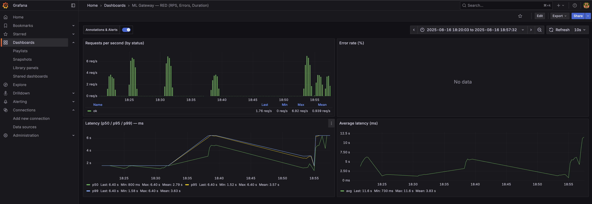

# ML Serving Platform

A production-ready ML inference gateway built with FastAPI, designed for high-performance model serving with comprehensive monitoring and Kubernetes deployment support.

## Overview

This platform provides a scalable gateway for machine learning model inference, featuring:
- FastAPI-based API gateway with async request handling
- Prometheus metrics collection and Grafana dashboards
- Kubernetes-native deployment with health checks
- Support for any model via llama.cpp backend
- Production-ready monitoring and observability

## Architecture

```
Client → ML Gateway (FastAPI) → llama.cpp Backend
                ↓
         Prometheus + Grafana
```

## Prerequisites

- Python 3.12+
- Docker
- Kubernetes cluster (Kind, Minikube, or cloud)
- llama.cpp server with GGUF models
- Helm 3.x

## Quick Start

### 1. Setup Environment
```bash
git clone <your-repo>
cd ml-serving-platform
python -m venv .venv
source .venv/bin/activate
pip install -r requirements.txt
```

### 2. Start Backend Model Server
```bash
llama-server -m ~/models/your-model.gguf -c 2048 -ngl 1 -t 6 --port 9000
```

### 3. Run Gateway
```bash
BACKEND_URL=http://localhost:9000 python -m uvicorn gateway.app:app --port 8080
```

### 4. Test Inference
```bash
curl -X POST http://localhost:8080/v1/infer \
  -H "Content-Type: application/json" \
  -d '{"prompt": "Hello, how are you?", "n_predict": 32}'
```

## Docker Deployment

### Build and Run
```bash
docker build -t ml-gateway:latest .
docker run -p 8080:8080 \
  -e BACKEND_URL=http://host.docker.internal:9000 \
  ml-gateway:latest
```

### Docker Compose
```yaml
version: '3.8'
services:
  gateway:
    build: .
    ports:
      - "8080:8080"
    environment:
      - BACKEND_URL=http://llama-server:9000
    depends_on:
      - llama-server
  
  llama-server:
    image: ghcr.io/ggerganov/llama.cpp:server
    ports:
      - "9000:8080"
    volumes:
      - ./models:/models
    command: ["--model", "/models/your-model.gguf", "--port", "8080"]
```

## Kubernetes Deployment

### 1. Setup Cluster and Monitoring
```bash
kind create cluster --name mlserv

helm repo add prometheus-community https://prometheus-community.github.io/helm-charts
helm repo update
kubectl create namespace monitoring
helm install kps prometheus-community/kube-prometheus-stack -n monitoring
```

### 2. Deploy Gateway
```bash
kubectl create namespace serving
kind load docker-image ml-gateway:latest --name mlserv
kubectl apply -f deploy/k8s/
```

### 3. Access Services
```bash
kubectl -n serving port-forward svc/gateway 8080:8080
kubectl -n monitoring port-forward svc/kps-grafana 3000:80
```

## Monitoring

### Metrics Endpoints
- Health Check: `GET /health`
- Metrics: `GET /metrics` (Prometheus format)
- API Docs: `GET /docs` (Swagger UI)

### Key Metrics
- `inference_requests_total` - Request count by status
- `inference_latency_ms` - Response time distribution

### Grafana Integration
Create dashboards using these PromQL queries:

- **Request Rate**: `rate(inference_requests_total{status="ok"}[1m])`
- **Latency P95**: `histogram_quantile(0.95, sum(rate(inference_latency_ms_bucket[5m])) by (le))`
- **Status Breakdown**: `rate(inference_requests_total[5m]) by (status)`

#### Example Dashboard


*Grafana dashboard showing real-time metrics: requests per second, latency percentiles (P50, P95, P99), and average latency for the ML Gateway.*

## Configuration

### Environment Variables
```bash
BACKEND_URL=http://localhost:9000    # Backend model server
LOG_LEVEL=INFO                       # Logging level
REQUEST_TIMEOUT=30                   # Request timeout (seconds)
```


## Development

### Setup Development Environment
```bash
pip install -r requirements.txt
pip install -r requirements-dev.txt


###S